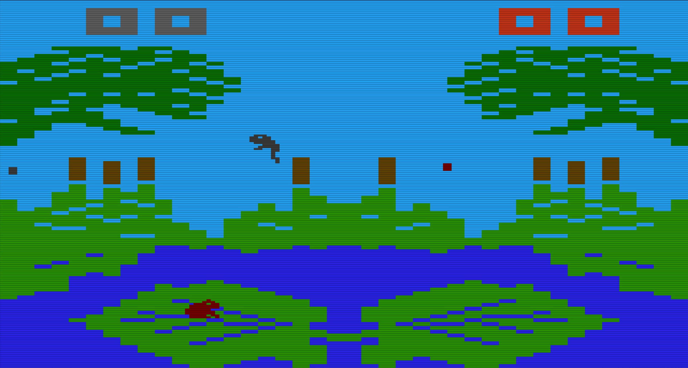

# Frogs and Flies

**2026 Jeff Molofee (NeHe)**

A faithful Python/pygame reimplementation of the classic **Frogs and Flies** (Activision, 1982) for the Atari 2600, reverse-engineered from the original 6502 assembly source.

<p align="center">
  
</p>

*Two frogs sit on lily pads, catching fireflies as the sky darkens over the course of the game.*

## Features

- Exact physics and game logic ported from 6502 assembly
- CRT scanline effect (toggleable)
- Keyboard and joystick/gamepad support for both players
- Easy / Normal difficulty per player (saved to config)
- Resizable window and fullscreen mode
- Authentic Atari NTSC color palette
- Attract mode AI when idle

## Controls

| Action    | Player 1 (left frog) | Player 2 (right frog) |
|-----------|----------------------|-----------------------|
| Hop       | WASD                 | Arrow keys            |
| Tongue    | Q                    | Right Shift           |
| Joystick  | Joystick 0           | Joystick 1            |

**Keyboard shortcuts:**
- `1` / `2` — Toggle Easy/Normal difficulty for Player 1 / Player 2
- `F` — Toggle fullscreen
- `C` — Toggle CRT scanline effect
- `B` — Toggle bounding boxes (debug)
- `ESC` — Quit

## Running from Source

**Requirements:** Python 3.11+ (including 3.14)

**Windows:** Double-click `start_app.bat` — it creates a local `.venv` and installs dependencies from `requirements.txt`, then launches the game. If `.venv` isn't set up yet, `start_app.bat` automatically triggers `install.bat` first; you can also run `install.bat` directly ahead of time if you just want dependencies installed without launching the game.

**Manual install:**
```bash
pip install --only-binary :all: pygame
python main.py
```

> **Note:** If `pygame` is not available for your Python version, install `pygame-ce` instead:
> ```bash
> pip install --only-binary :all: pygame-ce
> ```

## Building the Exe (Windows)

```bash
pip install pyinstaller
python -m PyInstaller --onefile --windowed --name "Frogs and Flies" --icon "frog_icon.ico" --add-data "sounds;sounds" --add-data "frog_icon.ico;." main.py
```

The exe will be in `dist/Frogs and Flies.exe`.

## Configuration

Settings are saved automatically to `frogs and flies.cfg` (JSON) next to the exe:

```json
{
    "PLAYER_0_EASY_MODE": true,
    "PLAYER_1_EASY_MODE": true,
    "FULLSCREEN": false,
    "CRT": true
}
```

## Project Structure

| File                    | Description                                           |
|-------------------------|-------------------------------------------------------|
| `start_app.bat`         | Windows launcher (auto-installs into .venv if missing) |
| `install.bat`           | Creates .venv and installs requirements.txt           |
| `main.py`               | Main game loop, input handling, game-over sequence    |
| `display_kernel.py`     | TIA-accurate scanline renderer                        |
| `frog_state_machine.py` | Frog state machine (sitting, hopping, tongue, jump-off) |
| `physics.py`            | Velocity/position physics matching 6502 ASM           |
| `firefly.py`            | Firefly (fly) movement and spawning                   |
| `collision.py`          | Frog–fly collision detection                          |
| `sound_system.py`       | Sound playback                                        |
| `config.py`             | Config load/save                                      |
| `tia_emulator.py`       | TIA memory/register emulation                         |
| `atari_ntsc_palette.py` | Atari NTSC color palette                              |
| `atari_rng.py`          | Atari 2600 LFSR random number generator               |
| `graphics_data.py`      | Sprite and graphics data                              |
| `sounds/`               | WAV sound effects                                     |

## Credits

Original game: **Frogs and Flies** by Activision (1982)  
Python reimplementation by [NeHe Productions](https://nehe.gamedev.net)
